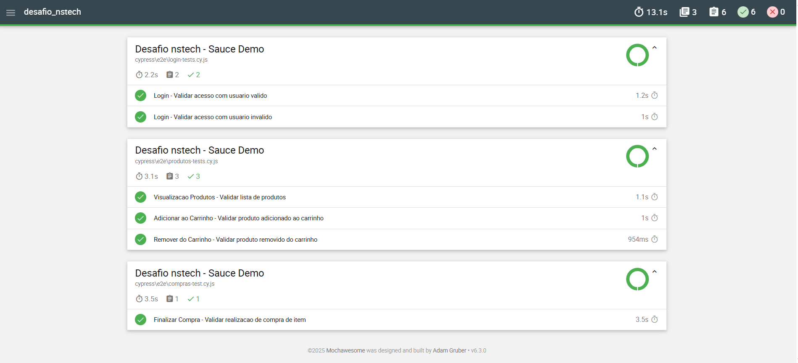

# desafio_nstech
Desafio Tecnico - QA Sr

### Abordagem

 Foi criado o projeto utilizando o cypress como framework de automação de testes, tendo como objetivo executar cenários dentro do site https://www.saucedemo.com/.

 Configurado o projeto e estruturado dentro da pasta "pages" tanto o mapeamento dos campos em suas respectivas páginas, bem como criados os métodos de ações para executar em cada uma delas.

 Após a execução dos cenários, caso o comando utilizado seja o de:

 ```npx cypress run```

 Então, o report dos testes processados são alocados na pasta "reports\html, onde é possível visualizar o resultado no arquivo "index.html"

 


### Casos de Testes

 - Login: Teste o login com um usuário válido e inválido
 - Visualização de Produtos: Teste a visualização da lista de produtos após o login
 - Adicionar ao Carrinho: Teste a adição de um ou mais produtos ao carrinho
 - Remover do Carrinho: Teste a remoção de produtos do carrinho
 - Finalizar Compra: Teste o fluxo de finalização de compra

### Tecnologias

Ferramentas utilizadas no projeto:

- [Node.js](https://nodejs.org/en/)
- [Cypress](https://www.cypress.io/)
- [JavaScript](https://www.javascript.com/)